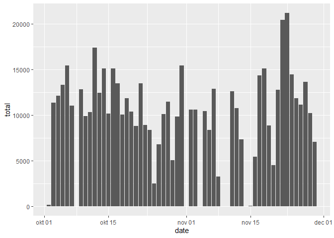
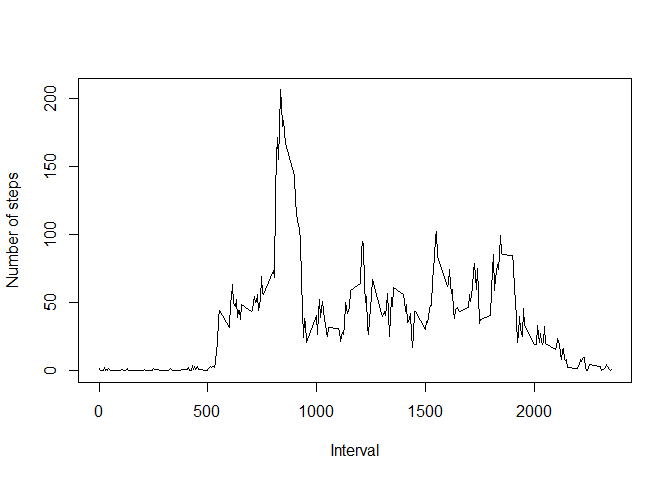
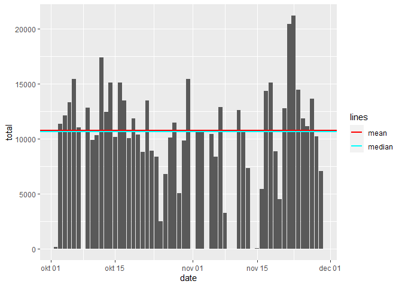
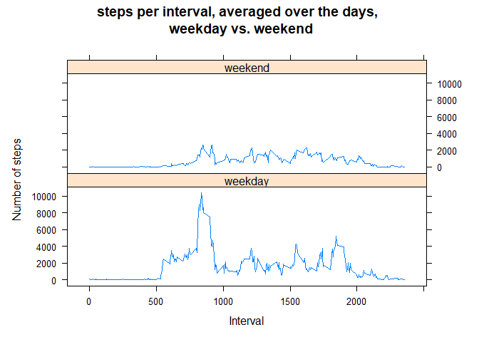

# Loading and preprocessing the data


## What is mean total number of steps taken per day?


### create table of sums of steps per day

```
## # A tibble: 61 × 2
##    date       total
##    <date>     <int>
##  1 2012-10-01    NA
##  2 2012-10-02   126
##  3 2012-10-03 11352
##  4 2012-10-04 12116
##  5 2012-10-05 13294
##  6 2012-10-06 15420
##  7 2012-10-07 11015
##  8 2012-10-08    NA
##  9 2012-10-09 12811
## 10 2012-10-10  9900
## # … with 51 more rows
```

### create a histogram of total number of steps each day

#### Using base R
This one removes the zero's, but keeps the 'steps' column name.


```r
total_steps_per_day <- aggregate(steps ~ date, data=tbl, FUN=sum)
```


#### Using the dplyr package


```r
total_steps_per_day <- tbl %>%                  
  group_by(date) %>%                          
  summarise_at(vars(steps),                    
               list(total = sum))
```

#### Second approach


```r
total_steps_per_day <- tbl %>%
  group_by(date) %>%
  summarise(total = sum(steps))
```


```r
ggplot(total_steps_per_day, aes(x=date, y=total)) + geom_histogram(stat = "identity")
```

<!-- -->

### Calculate and report the mean of the steps per day totals

```r
result_mean1 <- mean(total_steps_per_day$total, na.rm=TRUE)
result_mean1
```

```
## [1] 10766.19
```


### Calculate and report the median of the steps per day totals

```r
result_median1 <- median(total_steps_per_day$total, na.rm = TRUE)
result_median1
```

```
## [1] 10765
```

# What is the average daily activity pattern?

### Make a time series plot (i.e. type = "l" of the 5-minute interval (x-axis) and the average number of steps taken, averaged across all days (y-axis)


#### Using base R

```r
avg_per_time_interval <- aggregate(steps ~ interval, data=tbl, FUN=mean, na.rm = TRUE)
plot(steps~interval,data=avg_per_time_interval,type="l", xlab= "interval", ylab="Number of steps")
```

<!-- -->


#### using dplyr

```r
avg_per_time_interval <- tbl %>%
  group_by(interval) %>%
  summarise(average_steps = mean(steps, na.rm=TRUE))
plot(avg_per_time_interval$interval, avg_per_time_interval$average_steps, type="l", xlab="Interval", ylab="Number of steps")
```

<!-- -->

### Which 5-minute interval, on average across all the days in the dataset, contains the maximum number of steps?

```r
avg_per_time_interval[which.max(avg_per_time_interval$average_steps),]$interval
```

```
## [1] 835
```

# Imputing missing values


### Calculate and report the total number of missing values in the dataset (i.e. the total number of rows with NA\color{red}{\verb|NA|}NAs)

```r
count_NA <- sum(!complete.cases(tbl))
```

Total number of missing values: 2304 


### Devise a strategy for filling in all of the missing values in the dataset. 
Filling in missing values (NA) with mean value of 5-minute interval over the days,
mutating the dataset with the missing data filled in (didn't see any point in creating a new dataset here).


```r
for (i in 1:nrow(tbl)) {
  
  if (is.na(tbl$steps[i])) {
    
    interval <- tbl$interval[i]
                          
    tbl$steps[i] <- as.integer(avg_per_time_interval[which(avg_per_time_interval$interval==interval), "average_steps"])
  }}
```

## Make a histogram of the total number of steps taken each day.. 

### creating histogram total number of steps per day, approach 1

```r
new_total_steps_per_day <- aggregate(steps ~ date, data=tbl, sum)
plot1 <- ggplot(new_total_steps_per_day, aes(x=date, y=steps)) + geom_histogram(stat = "identity")
```

### creating histogram total number of steps per day, approach 2. 

```r
new_total_steps_per_day <- tbl[, list(total= sum(steps)) , by = date]
plot2 <- ggplot(total_steps_per_day, aes(x=date, y=total)) + geom_histogram(stat= "identity")
```

## and Calculate and report the mean and median total number of steps taken per day. 

```r
result_mean2 <- mean(new_total_steps_per_day$total, na.rm=TRUE)
```

The mean of the steps per day totals is 1.074977\times 10^{4}

```r
result_median2 <- median(new_total_steps_per_day$total, na.rm = TRUE)
```
The median of the steps per day totals is 10641

### render the new mean and median in the plot

```r
plot1 + geom_hline(aes(yintercept = result_mean2, col = "mean"), linetype = 1, size = 1) + 
  geom_hline(aes(yintercept = result_median2, color = "median"), linetype = 1, size = 1) + 
  scale_colour_manual(values = c("red", "cyan") , name = "lines")
```

<!-- -->


```r
plot2 + geom_hline(aes(yintercept = result_mean2, col = "mean"), linetype = 1, size = 1) + 
  geom_hline(aes(yintercept = result_median2, color = "median"), linetype = 1, size = 1) + 
  scale_colour_manual(values = c("red", "cyan") , name = "lines")
```

<!-- -->


## Do these values differ from the estimates from the first part of the assignment? What is the impact of imputing missing data on the estimates of the total daily number of steps?

Earlier the mean was 10766 and the median was 10765.
The mean is now 10750 and the median is now 10641.
They do not differ a lot.


# Are there differences in activity patterns between weekdays and weekends?

### Create a new factor variable in the dataset with two levels – “weekday” and “weekend” indicating whether a given date is a weekday or weekend day.


```r
weekday <- c("maandag", "dinsdag", "woensdag", "donderdag", "vrijdag")
weekend <- c("vrijdag", "zaterdag", "zondag")

tbl$weekday_or_weekend <- factor(case_when(weekdays(tbl$date) %in% weekday ~ "weekday",
                                           weekdays(tbl$date) %in% weekend ~ "weekend",
                                           TRUE                ~ NA_character_))
```

### Make a panel plot containing a time series plot (i.e. type = "l"\color{red}{\verb|type = "l"|}type = "l") of the 5-minute interval (x-axis) and the average number of steps taken, averaged across all weekday days or weekend days (y-axis). See the README file in the GitHub repository to see an example of what this plot should look like using simulated data.


```r
new_total_steps_per_day <- aggregate(steps ~ interval + weekday_or_weekend, data=tbl, sum)

xyplot(steps~interval|weekday_or_weekend,
       data=new_total_steps_per_day,
       main="steps per interval, averaged over the days, \n weekday vs. weekend",
       xlab="Interval",
       ylab="Number of steps",
       layout = c(1,2),
       type="l")
```

<!-- -->


